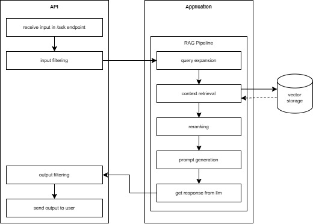

# RAG with API (FastAPI + ChromaDB + Ollama)

# Overview

This project is a Retrieval-Augmented Generation (RAG) API system built with FastAPI. It allows users to:
- Ingest documents into a vector database
- Query knowledge using LLMs (OpenAI, Ollama, DeepSeek)
- Apply input/output filtering for safety
- Perform retrieval, reranking, and response generation

# Project Architecture

This project follows a layered architecture, separating concerns between the API and core business logic.

## API Flow
```
API Layer (FastAPI)
        ↓
Application Layer (Business Logic)
```

- The API layer handles HTTP requests, validation, and responses.
- The Application layer contains the core logic, including:
  - Data ingestion
  - Query processing (RAG pipeline)
  - Filtering and validation
  - LLM interactions


## Experiment Flow
For experimentation and research, the project uses Jupyter Notebooks, which directly interact with the application layer:
```
Jupyter Notebook
        ↓
Application Layer (Business Logic)
```
- This allows rapid testing and iteration without going through the API layer.
- Useful for:
  - Prototyping RAG pipelines
  - Evaluating retrieval quality
  - Testing prompts and LLM behavior

# Folder Structures
The project is organized into three main areas:
```
API Layer        → Handles requests
Application Layer → Core logic (RAG, LLM, ingestion)
Supporting Tools → Storage, datasets, experiments
```

## 1. api/ — Entry Point (FastAPI Layer)

This is where everything starts.
- Receives incoming HTTP requests (/ask, /ingest)
- Validates input using schemas
- Calls the application layer
- Returns standardized responses

## 2. application/ — Core Logic (Brain of the System)

This is the most important part of the project.
It contains all business logic, split into focused modules:

### Main responsibilities:
- Filtering : Validate and sanitize input/output
- Ingestion : Process documents → chunk → embed → store in DB
- RAG Pipeline : Retrieve relevant data
- Rerank results : Generate answers using LLM
- LLM Integration : Supports multiple providers (OpenAI, Ollama, DeepSeek)

## 3. dataset/ — Sample Data
- Contains text/JSON files for ingestion and evaluation

## 4. notebooks/ — Experimentation
- Jupyter notebooks for:
  - Testing RAG pipeline
  - Evaluating results
  - Prompt experimentation

# End-to-End Flow
## Ingestion Flow
```
dataset/ → API (/ingest) → application/ingestion → chroma_db/
```

## Query Flow
```
User → API (/ask)
     → input filtering
     → RAG pipeline (retrieve + rerank)
     → LLM generation
     → output filtering
     → response
```



# Prerequisites

Before running the project, make sure you have the following installed:

## Required Tools
- Python 3.10+
- pip (Python package manager)

## LLM Requirements
- OpenAI: An OpenAI API Key
- Ollama
- DeepSeek (optional): Deepseek api key

## Install Dependencies
```
pip install -r requirements.txt
```
* the requirements.txt is automatically generated using pipreqs. the package version might need adjustment

# How to Run the Project

## 1. Setup Environment Variables
Rename `.env.example` to `.env` and insert your api key
```
DEEPSEEK_API_KEY=<your_deepseek_api_key_here>
OPENAI_API_KEY=<your_openai_api_key_here>
```

## 2. Start the FastAPI Server
Use script to run the server
```bash
./run.bat
```

or run manually 
```bash
uvicorn api.main:app
```

## 3. Access API Documentation
Once the server is running:
```
http://localhost:8000/docs
```
This opens the interactive Swagger UI. 

## 4. Perform Ingestion
Execute `/ingest_file` api to use the existing dataset

## 5. Perform query
Execute `/ask` api to submit your query and get response from the RAG system. Follow the format provided by Swagger for the request payload. You may check `dataset/machine_learning_knowledge_evaluation.json` for the example question. 